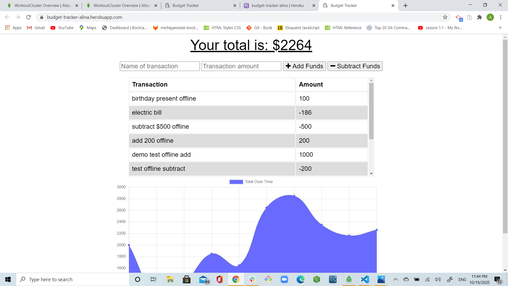
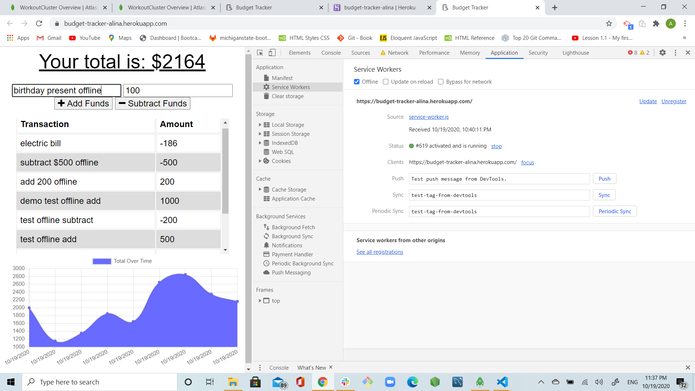
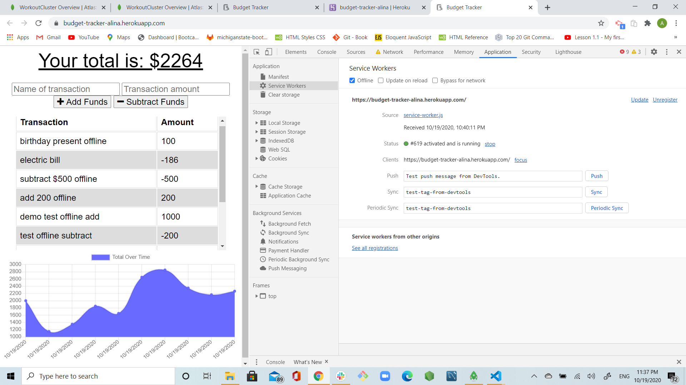

# budget-tracker

## Username:

agorelik2

## Title:

### Budget Tracker

[Link to the deployed application](https://budget-tracker-alina.herokuapp.com/)

## Table of Content

- [Description](#description)
- [User Story](#user-story)
- [Functionality](#functionality)
- [Database](#database)
- [Screen Shots](#screen-shots)
- [Development](#development)
- [Installation](#installation)
- [Dependencies](#dependencies)
- [Built With](#built-with)
- [Repo](#repo)
- [Demo](#demo)
- [Developer](#developer)

## Description

This application helps users to track their budget. Users are able to add expenses and deposits to their budget with or without a connection. When entering transactions offline, they should populate the total when brought back online. Giving users a fast and easy way to track their money is important, but allowing them to access that information anytime is even more important. Having offline functionality is paramount to this application.

## User Story

AS an avid traveller, I want to be able to track my withdrawals and deposits with or without a data/internet connection
so that my account balance is accurate when I am traveling.

## Functionality

Added functionality to an existing Budget Tracker application to allow for offline access and functionality.

Offline Functionality:

- Enter deposits offline

- Enter expenses offline

- When brought back online, offline entries should be added to tracker.

## Database

The app utilizes a MongoDB database with a Mongoose schema. The name of the database is 'budget'. The schema has only one collection called 'transactions' that is created and stored in models/transaction.js. If user is adding transactions while offline, the collection called 'pending' is being created, and the records are being moved to the 'transaction' collection as soon as user is back online.

```
const transactionSchema = new Schema(
  {
    name: {
      type: String,
      trim: true,
      required: "Enter a name for transaction"
    },
    value: {
      type: Number,
      required: "Enter an amount"
    },
    date: {
      type: Date,
      default: Date.now
    }
  }
);

const Transaction = mongoose.model("Transaction", transactionSchema);

module.exports = Transaction;
```

## Screen Shots

The main screen of the application shows the list of all the transactions incuding offline.


While offline, user entered transaction called "Birthday Present" and added \$100.00


The transaction saved in offline mode


Once user switched to online mode and refreshed, the "Birthday Present" for \$100.00 is still shown.


## Development

I created three new files: public/manifest.webmanifest, public/service-worker.js, public/indexedDB.js. Updated server.js and public/index.html to implement the changes I made to allow the application to work offline.
As soon the local environment was working and there no further errors, I deployed the app to heroku and ensured that I was able to enter offline transactions and the transactions were stored and properly displayed when I switched back to online mode.

## Installation

To use this application locally:

- Install Node.js on your computer.
- Use `npm install` to install all the dependencies, see [Dependencies](#dependencies) for the complete list
- Open a terminal, navigate to the folder where **_server.js_** is located and type: `node server.js`
- Once the server is running, open a browser and navigate to localhost:4000 or the port you have selected

## Dependencies

    "compression": "^1.7.4",
    "express": "^4.17.1",
    "lite-server": "^2.5.3",
    "mongoose": "^5.5.15",
    "morgan": "^1.9.1"

## Built With

- [VScode](https://code.visualstudio.com/)
- [Gitbash](https://gitforwindows.org/)
- [node.js](https://nodejs.org/en/)
- [express.js](https://expressjs.com/)
- [mongoDB](https://www.mongodb.com/)
- [Mongoose](https://mongoosejs.com/docs/guide.html)

## Repo:

https://github.com/agorelik2/budget-tracker

## Demo:

https://budget-tracker-alina.herokuapp.com/

## Developer

    Alina Gorelik
